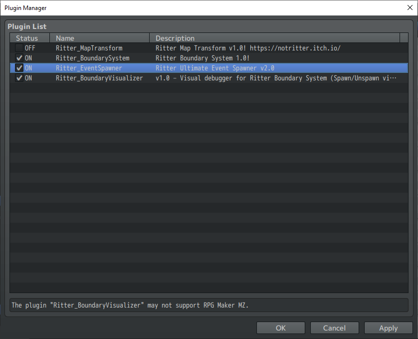
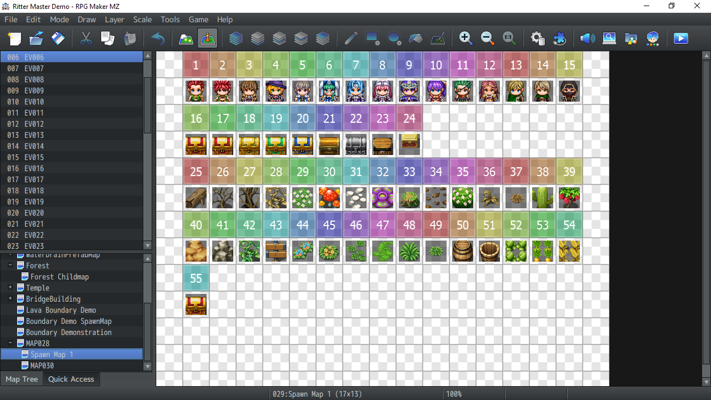

# Installation

Follow the steps below to install the **Ritter Ultimate Event Spawner** in your RPG Maker MV/MZ project.  
This guide walks you through downloading, enabling, configuring, and testing the plugin.

---

## 1. Download the Plugin

Download the plugin file and place it inside your project’s:

/js/plugins/

---

## 2. Enable the Plugin in Plugin Manager

Open your project’s **Plugin Manager** and add the following:

- `Ritter_EventSpawner`
- `Ritter_BoundarySystem` *(optional, but required if you want to use Boundaries)*

### **Plugin Load Order**

Ritter_BoundarySystem
Ritter_EventSpawner

---

## 3. Configure Plugin Parameters

After enabling the plugin, adjust its parameters to match your project’s needs.

Key configuration areas:

- Spawn Event Starting EventId Number
- - Spawn eventIds begin at this number
- Spawn Map Settings
- - Spawn Map Ids to preload

---

## 4. Create a Template Map for Source Events

The spawner works by copying “template events” from a dedicated map into gameplay maps.

To set this up:

1. Create a **new map** used only for storing template events  
2. Add events you want the spawner to generate during gameplay  
3. These events should **never** appear directly in your game  
4. The spawner duplicates them dynamically when needed  

This map acts like a library of spawnable events.

---

## 5. Playtest and Verify the Plugin

Run a playtest and confirm that the spawner is functioning properly.

Try the following:

- Execute **Plugin Commands** to spawn/unspawn events  
- Test **Script Calls** from the console using Guide linked below.
- Verify that template events correctly appear on the game map

---

## Next Steps

Once finished with installation, continue with the more guides:

- 👉 [Script Calls](script-calls.md)  
- 👉 [Plugin Commands](plugin-commands.md)  
- 👉 [Boundaries Overview](boundaries.md)  
- 👉 [Terrain-Based Spawning](terrain-spawning.md)  

These will walk you through every system in the spawner.

---
