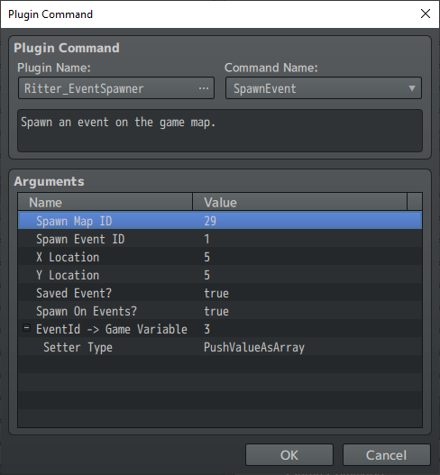
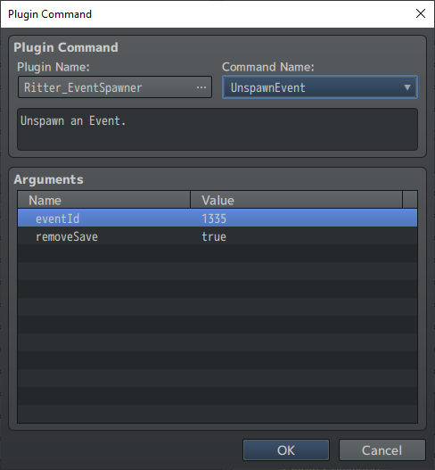
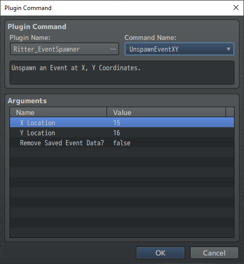

# Plugin Commands
MZ Only
{: .label .label-blue }

#### TABLE OF CONTENTS
 * [Spawn Event](https://notritter.github.io/SpawnerDocs/Documentation/plugincommands.html#spawn-event)
 * [Spawn Event Region](https://notritter.github.io/SpawnerDocs/Documentation/plugincommands.html#spawn-event-region)
 * [Spawn Event Terrain Tags](https://notritter.github.io/SpawnerDocs/Documentation/plugincommands.html#spawn-event-terrain-tag)
 * [Transform Event](https://notritter.github.io/SpawnerDocs/Documentation/plugincommands.html#transform-event)
 * [Unspawn Event](https://notritter.github.io/SpawnerDocs/Documentation/plugincommands.html#unspawn-event)
 * [Unspawn Event Xy](https://notritter.github.io/SpawnerDocs/Documentation/plugincommands.html#unspawn-event-xy)
 * [Unspawn All](https://notritter.github.io/SpawnerDocs/Documentation/plugincommands.html#unspawn-all)

---

## Spawn Event

 

Show/Hide Section

Spawns or recycles an event on the game map on to x,y coordinates by creating a copy of a template event located on a spawn map.

* **mapId**: The ID or name of the map containing the event.
* **eventId**: The ID or name of the event to spawn.
* **x, y**: Coordinates to place the event on the map.
* **save**: `true` to save for restoration on map re-entry, `false` for temporary.
* **spawnOnEvents**: `true` to allow spawning on top of other events.
* **EventId -> Game Variable**: Game Variable ID to store the EventId.
* **Setter Type**: How to store EventId in the Game Variable.

  * **Set Value As Integer**: Stores EventId as an integer.
  * **Push Value As Array**: Pushes EventId into the variable as an array.

---
## Spawn Event Region

Show/Hide Section

Spawns or recycles an event on the game map on to a random tile marked with the provided regionId(s) by creating a copy of a template event located on a spawn map.

* **mapId**: The ID of the map containing the event.
* **eventId**: The ID of the event to spawn.
* **regions**: Region ID(s) to randomly place the event. Use an array for multiple IDs, e.g., `[4,8,15,16,23,42]`.
* **save**: `true` to save for restoration, `false` for temporary.
* **spawnOnEvents**: `true` to allow spawning on top of other events.
* **EventId -> Game Variable**: Game Variable ID to store the EventId.
* **Setter Type**: How to store EventId in the Game Variable.

  * **Set Value As Integer**
  * **Push Value As Array**

---

## Spawn Event Terrain Tag

Show/Hide Section

Spawns or recycles an event on the game map on to a random tile marked with the provided terrain tag(s) by creating a copy of a template event located on a spawn map.

* **mapId**: The ID of the map containing the event.
* **eventId**: The ID of the event to spawn.
* **tags**: Terrain Tag ID(s) to randomly place the event. Use an array for multiple tags, e.g., `[4,8,15,16,23,42]`.
* **save**: `true` to save for restoration, `false` for temporary.
* **spawnOnEvents**: `true` to allow spawning on top of other events.
* **EventId -> Game Variable**: Game Variable ID to store the EventId.
* **Setter Type**: How to store EventId in the Game Variable.

  * **Set Value As Integer**
  * **Push Value As Array**

---

## Transform Event

Show/Hide Section

Transforms an event on the game map into a copy of a template event located on a spawn map.

* **eventId**: ID of the event on the map to transform.
* **mapId**: Spawn map ID containing the template event.
* **spawnId**: ID of the template event on the spawn map.

---

## Unspawn Event

Show/Hide Section

Unspawns an event on the game map using it’s `eventId` and sets the unspawned `Game_Event` object to be **recycled** for future spawns.

* **eventId**: ID of the event to unspawn.
* **removeSave**: `true` to remove from saved events, `false` or empty to retain.

---

## Unspawn Event XY

Show/Hide Section

Unspawns an event on the game map using `x`,`y` coordinates and prepares the unspawned `Game_Event` object to be recycled for future spawns.

* **x, y**: Coordinates to check for the event.
* **removeSave**: `true` to remove from saved events, `false` or empty to retain.

---

## Unspawn All

Show/Hide Section

Unspawns all events on the game map and prepares the unspawned `Game_Event` objects to be **recycled** for future spawns.

* **removeSave**: `true` to delete all saved events, leave empty to retain.

