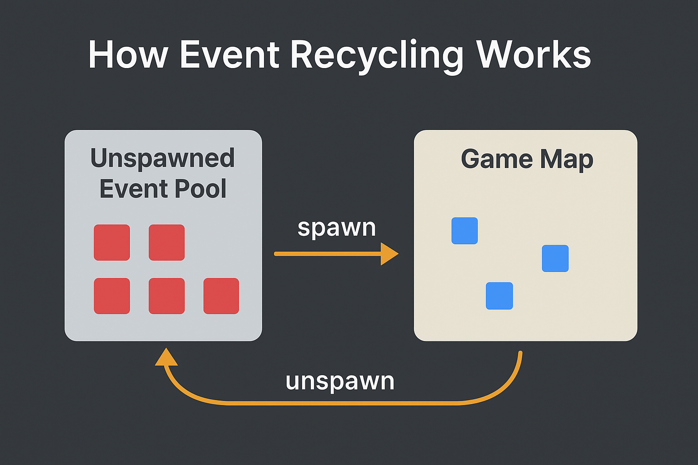

## Event Recycling

Event recycling is one of the core features that makes the **Ultimate Event Spawner** fast, scalable, and safe to use even on large, event-dense maps. Instead of continually creating new `Game_Event` objects, which gradually increases memory usage and hurts performance, the spawner reuses events you’ve previously unspawned.

### How It Works

#### 1. Unspawned events are stored in a pool

Normally, unspawning an event in RPG Maker means *erasing it permanently*. With recycling enabled, the system behaves more intelligently:

* The event’s `Game_Event` instance is moved off-map to **(-1, -1)**.
* It is added to the internal **unspawn pool** (`Ritter._unspawnList`).
* The event is safely erased and made inactive.
* Saved-event data is kept or discarded based on your settings.

At this point, the event is no longer visible or interactive, but the actual `Game_Event` object still exists and is ready to be reused.

#### 2. When spawning, the system checks the pool first

When a new event is spawned:

* The spawner checks the unspawn pool.
* **If a recycled event is available:**

  * The next available event is pulled from the pool.
  * It is transformed into the desired spawn event.
* **If the pool is empty:**

  * A brand‑new `Game_Event` is created normally.

This ensures your project rarely creates new event objects at runtime, significantly reducing performance overhead.

#### 3. Consistent long‑term performance

Because the system recycles rather than repeatedly constructing and destroying events:

* No unused event clutter accumulates in memory.
* Frame rate remains stable even after hours of gameplay.
* Opens the door to large-scale and continuous spawning.
* The engine avoids slowdown caused by hundreds of inactive events.

This spawner breezes through extreme stress‑tests with **tens of millions** of spawns and unspawns without any performance loss.

### Why This Matters

Event recycling makes the spawner ideal for:

* Open‑world maps
* Random encounter systems
* Dynamic NPC populations
* Survival and crafting systems
* Tower defense waves
* Action Battle System enemies and interactables
* Farming and life‑sim mechanics
* Endless runner object generation
* Any game requiring constant spawning and cleanup

Instead of unspawned erased events piling up over time, you get a stable system that performs the same at **20 hours** as it did at **2 minutes**.
